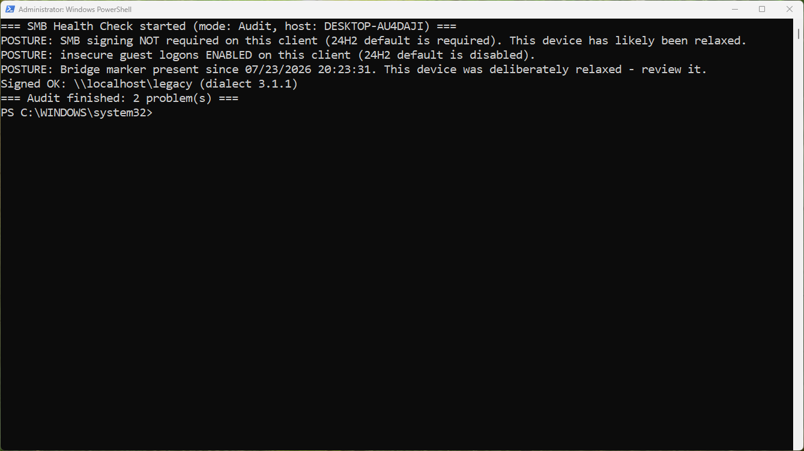

# Atliso SMB Health Check

A PowerShell script that audits SMB client posture and live connections on Windows 11 24H2+ devices. Finds the servers that will break, or have already broken, under the 24H2 SMB signing and guest-auth defaults.

Windows 11 24H2 requires SMB signing on all outbound connections and disables insecure guest fallback on Pro. Any NAS, Samba server or appliance that can't sign stops answering, and users see `0x80070035`, `STATUS_INVALID_SIGNATURE`, or the blocked guest access message. Most fixes floating around disable signing on the client fleet-wide. That's a security regression, not a fix. This script tells you exactly which devices and which servers are affected before you change anything.



## What it does

Three modes, set at the top of the script or via `-Mode`:

- **Audit** (default). Report only. Checks the client's signing and guest-logon posture against 24H2 defaults, then inspects every live SMB connection and flags unsigned sessions with the server name and dialect. Writes a timestamped log and exits `1` if problems are found, `0` if clean. Those exit codes mean it drops straight into Intune as a detection script.
- **Bridge**. The temporary compatibility relaxation, done properly. Allows unsigned SMB and guest logons on this client, logs exactly what it changed and when, and stamps a marker file so bridged devices can be found and reversed later. Use it narrowly. Fix the server instead wherever you can.
- **Restore**. Reverses Bridge. Re-hardens the client to 24H2 defaults and removes the marker.

## Configuration

One block:

```powershell
# Servers you KNOW can't sign and have accepted the risk for (lowercase).
# Audit still reports them but won't fail the exit code because of them.
$KnownExceptions = @()   # e.g. @("old-nas01", "printbox")
```

Nothing else needs editing.

## Usage

```powershell
# Report only (default)
.\Atliso-SmbHealthCheck.ps1

# Temporary relaxation on a device that must reach a server that can't sign
.\Atliso-SmbHealthCheck.ps1 -Mode Bridge

# Re-harden
.\Atliso-SmbHealthCheck.ps1 -Mode Restore
```

Run as admin or SYSTEM. It reads and, in Bridge/Restore, writes machine-level SMB configuration. The log goes to `%LOCALAPPDATA%\Atliso\SmbHealthCheck.log`, or `%ProgramData%\Atliso\` when running as SYSTEM.

## Deploy through Intune

Run it as a **Remediation**, not a platform script. The point is fleet visibility.

1. **Devices > Scripts and remediations > Remediations** > Create.
2. Detection script: `Atliso-SmbHealthCheck.ps1` as-is. Audit is the default and the exit codes are already remediation-shaped.
3. Remediation script: optional. For automatic bridging on a scoped group of known-bad devices, use a copy with `$Mode = "Bridge"`. Most fleets should leave remediation empty and treat the detection results as the worklist.
4. Run in 64-bit PowerShell: Yes. System context is fine.
5. Assign to a device group. Start with a pilot ring.

Within a day you have a list of exactly which devices can't reach which servers and why, without changing anything. Fix signing on the servers on that list and watch the detections go green.

## The right order of operations

1. Audit first.
2. Fix the server, not the client. Windows Server and current Synology, QNAP, TrueNAS and Samba builds all support signing. Turn it on there.
3. Give guest shares real credentials.
4. Bridge only what genuinely can't sign, tag it, review it, Restore it when the server is fixed.

Why that order, which errors mean what, and the full walkthrough with screenshots: [Windows 11 24H2 Broke Your Mapped Drives. Here's the Fix That Doesn't Kill Security](https://atliso.com/blog/windows-11-24h2-mapped-drives-smb-fix)

## Verify

```powershell
Get-SmbConnection | Select-Object ServerName, ShareName, Signed
Get-Content $env:LOCALAPPDATA\Atliso\SmbHealthCheck.log -Tail 20
```

Healthy is `Signed: True` on every row. If a connection still shows unsigned after fixing the server, the client cached the old session. `net use * /delete` and reconnect, or reboot.

## Requirements

- Windows 11 (tested on 24H2), Windows 10 22H2 works for auditing
- PowerShell 5.1 or later
- Admin or SYSTEM for Bridge and Restore

## Get updates

Microsoft changes SMB behaviour more often than you'd think. Subscribers hear first when a script here needs updating, along with new tools as they ship. No spam.

**[Get tools by email at atliso.com](https://atliso.com/tools)**

## Licence

MIT. Use it, modify it, ship it. See [LICENSE](LICENSE).
